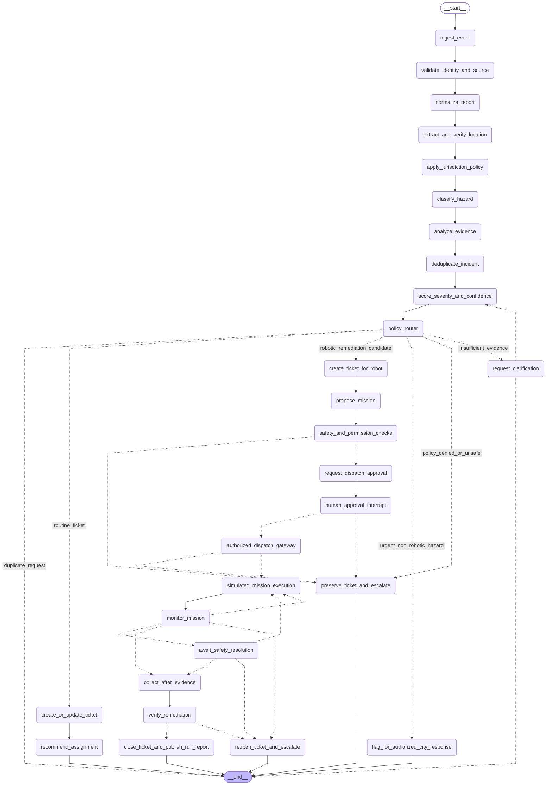

# `ticket` graph (generated)

Generated from the compiled LangGraph with `scripts/export_graphs.py`. Dotted edges are conditional.

```mermaid
---
config:
  flowchart:
    curve: linear
---
graph TD;
	__start__([<p>__start__</p>]):::first
	ingest_event(ingest_event)
	validate_identity_and_source(validate_identity_and_source)
	normalize_report(normalize_report)
	extract_and_verify_location(extract_and_verify_location)
	apply_jurisdiction_policy(apply_jurisdiction_policy)
	classify_hazard(classify_hazard)
	analyze_evidence(analyze_evidence)
	deduplicate_incident(deduplicate_incident)
	score_severity_and_confidence(score_severity_and_confidence)
	policy_router(policy_router)
	request_clarification(request_clarification)
	create_or_update_ticket(create_or_update_ticket)
	recommend_assignment(recommend_assignment)
	create_ticket_for_robot(create_ticket_for_robot)
	propose_mission(propose_mission)
	safety_and_permission_checks(safety_and_permission_checks)
	request_dispatch_approval(request_dispatch_approval)
	human_approval_interrupt(human_approval_interrupt)
	authorized_dispatch_gateway(authorized_dispatch_gateway)
	simulated_mission_execution(simulated_mission_execution)
	monitor_mission(monitor_mission)
	await_safety_resolution(await_safety_resolution)
	collect_after_evidence(collect_after_evidence)
	verify_remediation(verify_remediation)
	close_ticket_and_publish_run_report(close_ticket_and_publish_run_report)
	reopen_ticket_and_escalate(reopen_ticket_and_escalate)
	flag_for_authorized_city_response(flag_for_authorized_city_response)
	preserve_ticket_and_escalate(preserve_ticket_and_escalate)
	__end__([<p>__end__</p>]):::last
	__start__ --> ingest_event;
	analyze_evidence --> deduplicate_incident;
	apply_jurisdiction_policy --> classify_hazard;
	authorized_dispatch_gateway -.-> preserve_ticket_and_escalate;
	authorized_dispatch_gateway -.-> simulated_mission_execution;
	await_safety_resolution -.-> collect_after_evidence;
	await_safety_resolution -.-> reopen_ticket_and_escalate;
	await_safety_resolution -.-> simulated_mission_execution;
	classify_hazard --> analyze_evidence;
	collect_after_evidence --> verify_remediation;
	create_or_update_ticket --> recommend_assignment;
	create_ticket_for_robot --> propose_mission;
	deduplicate_incident --> score_severity_and_confidence;
	extract_and_verify_location --> apply_jurisdiction_policy;
	human_approval_interrupt -.-> authorized_dispatch_gateway;
	human_approval_interrupt -.-> preserve_ticket_and_escalate;
	ingest_event --> validate_identity_and_source;
	monitor_mission -.-> await_safety_resolution;
	monitor_mission -.-> collect_after_evidence;
	monitor_mission -.-> reopen_ticket_and_escalate;
	monitor_mission -.-> simulated_mission_execution;
	normalize_report --> extract_and_verify_location;
	policy_router -. &nbsp;duplicate_request&nbsp; .-> __end__;
	policy_router -. &nbsp;routine_ticket&nbsp; .-> create_or_update_ticket;
	policy_router -. &nbsp;robotic_remediation_candidate&nbsp; .-> create_ticket_for_robot;
	policy_router -. &nbsp;urgent_non_robotic_hazard&nbsp; .-> flag_for_authorized_city_response;
	policy_router -. &nbsp;policy_denied_or_unsafe&nbsp; .-> preserve_ticket_and_escalate;
	policy_router -. &nbsp;insufficient_evidence&nbsp; .-> request_clarification;
	propose_mission --> safety_and_permission_checks;
	request_clarification -.-> __end__;
	request_clarification -.-> score_severity_and_confidence;
	request_dispatch_approval --> human_approval_interrupt;
	safety_and_permission_checks -.-> preserve_ticket_and_escalate;
	safety_and_permission_checks -.-> request_dispatch_approval;
	score_severity_and_confidence --> policy_router;
	simulated_mission_execution --> monitor_mission;
	validate_identity_and_source --> normalize_report;
	verify_remediation -.-> close_ticket_and_publish_run_report;
	verify_remediation -.-> reopen_ticket_and_escalate;
	close_ticket_and_publish_run_report --> __end__;
	flag_for_authorized_city_response --> __end__;
	preserve_ticket_and_escalate --> __end__;
	recommend_assignment --> __end__;
	reopen_ticket_and_escalate --> __end__;
	classDef default fill:#f2f0ff,line-height:1.2
	classDef first fill-opacity:0
	classDef last fill:#bfb6fc
```
